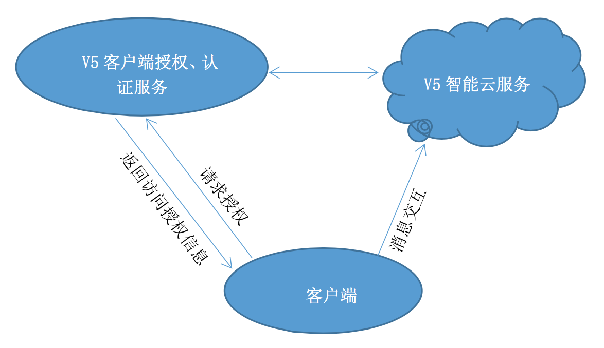
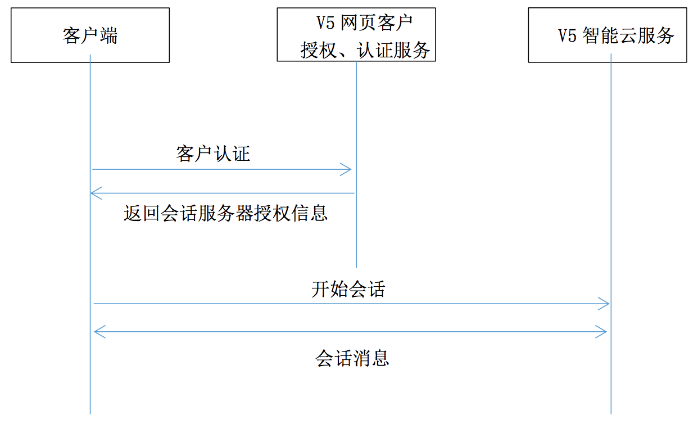
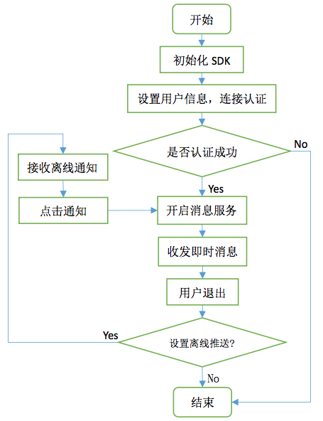
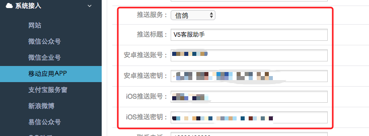
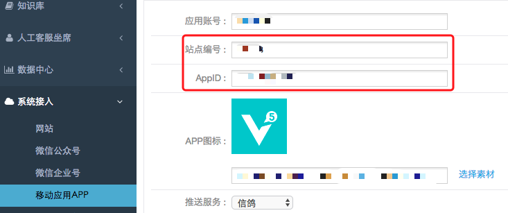

# V5KFClientSDK-iOS
> 此为V5KF智能客服iOS客户端SDK详细接口文档，无深入定制需求的客户可参考[基础文档](./README.md)。

- [1 术语](#1-术语)
- [2 功能说明](#2-功能说明)
- [3 业务流程](#3-业务流程)
  - [3.1 业务结构](#31-业务结构)
  - [3.2 交互流程](#32-交互流程)
  - [3.3 SDK工作流程](#33-sdk工作流程)
- [4 前期准备](#4-前期准备)
  - [4.1 开发环境准备](#41-开发环境准备)
  - [4.2 SDK导入](#42-sdk导入)
  	 - [4.2.1 Objective-C 项目](#421-objective-c项目)
  	 - [4.2.2 Swift 项目](#422-swift项目)
  	 - [4.2.3 引入依赖库](#423-引入依赖库)
  	 - [4.2.4 CocoaPods导入](#424-cocoapods导入)
  - [4.3 Info.plist 配置](#43-infoplist配置)
  	 - [4.3.1 ATS](#431-ats)
  	 - [4.3.2 权限](#432-权限)
- [5 使用 SDK 提供的 UI 快速集成](#5-使用sdk提供的ui快速集成)
  - [5.1 初始化SDK](#51-初始化sdk)
  - [5.2 用户信息和参数设置](#52-用户信息和参数设置)
  - [5.3 启动会话界面](#53-启动会话界面)
  - [5.4 生命周期处理](#54-生命周期处理)
  - [5.5 对话界面代理](#55-对话界面代理)
  - [5.6 会话界面自定义](#56-会话界面自定义)
- [6 使用SDK接口开发](#6-使用sdk接口开发)
  - [6.1 初始化SDK](#61-初始化sdk)
  - [6.2 用户信息和参数设置](#62-用户信息和参数设置)
  - [6.3 开启消息服务](#63-开启消息服务)
  - [6.4 消息代理](#64-消息代理)
  - [6.5 消息接口调用](#65-消息接口调用)
  - [6.6 生命周期处理](#66-生命周期处理)
  - [6.7 获得开场白消息](#67-获得开场白消息)
  - [6.8 查询会话消息](#68-查询会话消息)
- [7 其他事项](#7-其他事项)
  - [7.1 版本更新](#71-版本更新)
  - [7.2 异常及枚举说明](#72-异常及枚举说明)
- [更新记录](#更新记录)

## 1 术语
- **应用账号**: V5KF 网站后台 AppSDK 应用配置中的应用账号。
- **站点编号**: V5KF 网站的账号对应的站点编号(可以在 V5KF 官网后台查看或向客服获取)。 
- **Demo 工程**: 使用智能客服系统 SDK 客户端开发的接口使用示例工程。 
- **会话界面**: 针对使用本 SDK 的 iOS APP 而言，表示进行对话的一个 UIViewController。 
- **deviceToken**: 推送平台用于标识设备的唯一 ID，长度为 64 字节以内的字符串。
- **用户 ID(uid)**: 标识 APP 所登录的用户的唯一 ID，长度为 64 字节以内的字符串。 
- **坐席**: 使用 V5 智能客服系统的客服登录席位，本文即指客服工作者。
- **openId**: 标识 APP 所登录的用户的唯一 ID，长度为 32 字节以内的字符串，合法的openId将从App SDK端透传到座席端。

## 2 功能说明
V5 智能客服系统客户端可集成到 web、APP 等第三方平台提供客户在线咨询服务，实时接收客户的反馈。支持发送文本、语音、图片以及表情等消息，并可显示图文、打开链接。

本文档介绍 V5 智能客服系统客户端 SDK 的 iOS 版本的集成和使用。本 SDK 兼容 `iOS 8.0` 以上，并为开发者提供 Demo 工程，可以参照 Demo，使用 SDK 提供的 UI 快速集成到你的 项目中;对 UI 有较高定制需求的开发者可根据 SDK 接口进行开发，自行开发界面。

## 3 业务流程
### 3.1 业务结构


- V5智能云服务
> V5智能云服务，是连接座席和访客的桥梁。并通过云智能机器人，提供替代、协助座席进行优质客服的服务。

- V5客户端授权、认证服务
> 分发访客接入V5智能云服务的凭据服务器。

### 3.2 交互流程

- 客户端首先向 V5 客户端授权、认证服务发送认证信息(HTTP POST 请求方式)，以 获取连接 V5 智能云服务的授权信息;
- 用认证成功返回的授权信息向V5智能云服务建立会话连接;
- 开启会话，进行即时消息对话。



### 3.3 SDK工作流程


## 4 前期准备
### 4.1 开发环境准备

1. V5KF客服系统账号
> 没有 V5KF 账号需要前往[官网](http://www.v5kf.com)注册账号。

2. 获得应用账号、站点编号
> 应用账号、站点编号作为 SDK 连接服务端的身份凭证，可登录V5KF管理后台在 "系统接入" -> "移动应用APP" 配置界面获取。

3. 填写对应平台的推送服务器地址(非必需)
> 为了使您的 APP 在集成本 SDK 后具有离线消息推送，建议填写您的推送服务器地址，同时也支持第三方推送平台，需要按照本文档规定填写您的 device_token 和绑定的用户 ID。



4. 下载 SDK
> 您可以到 V5KF 官网或者[V5KF Github](https://github.com/V5KF/V5KFClientSDK-iOS)*(建议)*页下载智能客服 SDK，包含了开发包和带 UI 界面的 Demo 示例工程，使用CocoaPods导入则可不用下载。

5. 环境要求
> 在您集成智能客服 SDK 前环境要求如下:
	- 支持的最低版本 iOS 8.0。
	- 支持 ARC 的 Xcode 编译器，建议使用最新版本。

### 4.2 SDK导入


#### 4.2.1 Objective-C项目

把V5ClientSDK 文件夹拷贝到您的工程路径下面，然后在工程目录结构中，右键选择 *Add Files to “工程名”* 。或者将这个文件夹拖入 Xcode 工程目录结构中，并选择Create groups。

#### 4.2.2 Swift项目

* 按照上面的方法引入V5ClientSDK 的文件。
* 在 Bridging Header 头文件中，加入`#import “V5ClientAgent.h”`等相关头文件。注：[如何添加 Bridging Header](http://bencoding.com/2015/04/15/adding-a-swift-bridge-header-manually/)。

> 注：此SDK为Objective-C开发，可能存在不适用swift的情况

#### 4.2.3 引入依赖库

V5Client的实现依赖了一些系统框架，在开发应用时，要在工程里加入这些框架。开发者首先点击工程右边的工程名，然后在工程名右边依次选择 *TARGETS* -> *General* -> *Linked Frameworks and Libraries*，展开 *Linked Frameworks and Libraries* 后点击展开后下面的 *+* 来添加下面的依赖项:

- libsqlite3.tbd
- libicucore.tbd
- stdc++.tbd
- AVFoundation.framework
- AudioToolbox.framework
- CFNetwork.framework
- Security.framework
- MediaPlayer.framework

##### 4.2.4 CocoaPods导入
使用CocoaPods管理依赖库的可以更方便的导入SDK。只需要在 `Podfile` 中加入：

```
platform :ios, '8.0'

pod 'V5ClientSDK', '~> 1.2.6'
```

接着pod安装 即可：

	$ pod install

有新版本更新时：

	$ pod update V5ClientSDK

如果运行以上命令，没有搜到或者搜不到最新版本，您可以运行以下命令，更新一下您本地的 CocoaPods 源列表：

	pod repo update  

### 4.3 Info.plist配置
#### 4.3.1 ATS

由于 iOS 9 的新特性默认使用 `ATS`，所有网络请求都需要在安全的连接下(当前 App Store 尚未强制使用iOS 9这一新特性)，所以一些不兼容的服务需要进行额外的配置，本SDK使用到了语音和图片服务的 webservice 接口，需在 `Info.plist` 添加下述配置:

```
<key>NSAppTransportSecurity</key> 
	<dict>
		<key>NSAllowsArbitraryLoads</key>
       <true/>
    </dict>
```

关于这一特性的详细说明和解决方案可参考:
[https://github.com/ChenYilong/iOS9AdaptationTips](https://github.com/ChenYilong/iOS9AdaptationTips)

**注:** 本SDK 1.1.10 以上版本已完全兼容 `HTTPS`，若无特殊需求，无需配置此 ATS 项， 可直接采用 https 方式连接，SDK 默认会将访问的网络图片(比如用户头像)和其他网络请 求进行自动转为 `https` 方式访问，若目标站点未支持 https 仍需要 http 访问，可通过设置` [V5ClientAgent shareClient].config.autoSSL = NO `来取消自动转 `https`，并自行配置好对应的 `ATS` 选项。

#### 4.3.2 权限

由于 SDK 中使用到相册和相机，在 Info.plist 中需要加入以下内容: (文中以 XML 格式描述)

```
<key>NSPhotoLibraryUsageDescription</key> 
<string>Choose photo</string> 
<key>NSCameraUsageDescription</key> 
<string>Take pictures</string>
<key>NSMicrophoneUsageDescription</key>
<string>Record voice</string>
```

## 5 使用SDK提供的UI快速集成
### 5.1 初始化SDK

将SDK文件添加到工程后，在`AppDelegate`中`import “V5ClientAgent.h“`文件，然后在 `application: willFinishLaunchingWithOptions:`函数中初始化 SDK 。示例如下:

```
- (BOOL)application:(UIApplication *)application didFinishLaunchingWithOptions:(NSDictionary *)launchOptions {
    // Override point for customization after application launch. 
    // 初始化SDK
    [V5ClientAgent initWithSiteId:@"10000"
                            appId:@"19cfb0800f474"
                   exceptionBlock:nil];
    return YES;
}
```
其中 `siteId` 和 `account` 分别是从 V5 后台可以获取到的站点编号和AppID。


### 5.2 用户信息和参数设置
使用 SDK 提供的 UI 集成，需要在**启动会话界面之前**进行用户信息和参数配置。配置项如下:

```objective-c
//需要#import "V5ClientAgent.h"
//获得V5ClientAgent配置对象
V5Config *config = [V5ClientAgent shareClient].config;
//设置用户信息，坐席端可查看
config.nickname = @"test-张三";
config.gender = 1; //性别:0-未知 1-男 2-女
config.avatar = @"头像URL"; //客户头像URL
config.vip = 2; //VIP等级
//openId:用户唯一ID,长度32字节以内,不同的openId消息记录单独保存,可透传到座席端提供给座席插件,替代v1.2.0之前版本的uid（uid不再使用）
//若您是旧版本SDK用户，只是想升级，为兼容旧版，避免客户信息改变可继续使用config.uid，可不用openId
config.openId = @"ios-user-id-for-test";
// 注：openId尽量不要携带特殊字符（$&+,/:;=?@%#[]以及空格之类的字符），若包含则会经过urlencode编码，客席插件收到这样的oid后要相应的解码处理(decodeURIComponent)
// 添加自定义用户信息NSDictionary,(仅在开启对话页面前设置生效)
config.userInfo = @{@"商品名称": @"牛仔裤", 
					@"商品价格": @"¥168.00"};

//用户信息单次设置即生效，更新用户信息或者切换用户时需调用shouldUpdateUserInfo 
//[config shouldUpdateUserInfo];
```

### 5.3 启动会话界面
通过简单地添加一个在线咨询按钮即可使用智能客服客户端功能，在按钮点击事件处理中加入启动会话界面的代码:

```objective-c
V5ChatViewController *chatViewController = [V5ClientAgent createChatViewController];
// 不显示底部栏(有底部栏的需加此配置) 
chatViewController.hidesBottomBarWhenPushed = YES;

/* 下面为会话界面配置，非必须，可根据需求自定义配置，均有默认值 */
// 会话界面的代理V5ChatViewDelegate
chatViewController.delegate = self; 
chatViewController.deviceToken = @"设备的deviceToken"; // 也可在config设置deviceToken
// 允许并设置消息铃声SystemSoundID 
chatViewController.allowSound = YES; 
chatViewController.soundID = 1007;
// 允许发送语音 
chatViewController.enableVoiceRecord = YES; 
// 允许显示头像
chatViewController.showAvatar = YES;
// 头像圆角(0~20之间)
chatViewController.avatarRadius = 6;
// 每次下拉获取历史消息最大数量，默认10 
chatViewController.numOfMessagesOnRefresh = 10;
// 开场显示历史消息数量，默认0(显示历史消息>0则无开场白)
chatViewController.numOfMessagesOnOpen = 10;
// 设置会话界面标题
chatViewController.title = @"V5客服"; // 设置标题，默认@“小五”
// 设置返回按钮标题(默认为前一页面标题)
UIBarButtonItem *myBackItem = [[UIBarButtonItem alloc] init]; 
myBackItem.title = @"返回";
self.navigationItem.backBarButtonItem = myBackItem;
// 设置开场白方式,启动会话前设置，默认ClientOpenModeDefault
// ClientOpenModeQuestion结合后台机器人培训内容可根据使用场景配置不同需求的开场消息
[chatViewController setClientOpenMode:ClientOpenModeDefault withParam:nil];

// 启动会话界面，使用导航模式推出视图
[self.navigationController pushViewController:(UIViewController *)chatViewController animated:YES];
```

 如果SDK使用在iPad里，启动会话界面可采用`PopoverViewController`方式，以及限制横屏状态的处理方式，具体配置如下：

```objective-c
// 页面呈现方式presentType默认PresentType_Push, PopoverViewController下改为PresentType_Popover
chatViewController.presentType = PresentType_Popover;
chatViewController.view.transform = CGAffineTransformMakeScale(0.7, 0.7);

UIPopoverController* popover = [[UIPopoverController alloc] initWithContentViewController:chatViewController];
[popover setBackgroundColor:[UIColor colorWithRed:235.0/255 green:235.0/255 blue:235.0/255 alpha:1]];
popover.popoverContentSize = CGSizeMake(chatViewController.view.frame.size.width, chatViewController.view.frame.size.height);
[popover presentPopoverFromRect:CGRectMake(0,618,1024,50) inView:self.view permittedArrowDirections:UIPopoverArrowDirectionDown animated:YES];

// 需要**限制横屏**打开时(UIInterfaceOrientationMaskLandscape)，为解决发送图片时选择图库打开页面异常问题，需要在AppDelegate做如下处理
/* 需要手动控制屏幕方向时使用，比如iPad横屏情况 */
- (UIInterfaceOrientationMask)application:(UIApplication *)application supportedInterfaceOrientationsForWindow:(UIWindow *)window {
    if ([V5ClientAgent shareClient].isPhotoLibrary) { //必须,否则打开图库异常
        return UIInterfaceOrientationMaskAll;
    } else {
        return UIInterfaceOrientationMaskLandscape;
    }
}
```

此外，页面的代理包含的方法如下，有相应需求的可使用，非必须:

```objective-c
@protocol V5ChatViewDelegate <NSObject> @optional
/**
 * 即将打开会话视图
 */
- (void)clientViewWillAppear;

/**
 * 会话视图打开后
 */
- (void)clientViewDidAppear;

/**
 * 即将关闭会话视图
 */
- (void)clientViewWillDisappear;

/**
 * 关闭会话视图后
 */
- (void)clientViewDidDisappear;

/**
 * 用户点击链接，包括普通URL(HTML超链接)、图文链接、电话号码
 * @param url 链接地址
 */
- (void)userClickLink:(NSString *)url linkType:(KV5LinkType)linkType;

/**
 * 用户点击位置消息
 * @param lat 纬度
 * @param lng 经度
 */
- (void)userClickLocationWithLatitude:(double)lat longitude:(double)lng;

/**
 * 用户点击图片消息
 * @param image 图片
 * @param url 图片链接
 */
- (void)userClickImageWithImage:(UIImage *)image picUrl:(NSString *)url;

/**
 * 用户在会话视图中收到消息
 * @param message 消息对象
 */
- (void)clientDidReceiveMessage:(V5Message *)message;

/**
 * 用户将要发送消息(可在此向坐席透传自定义参数，参考Demo)
 * @param message 将要发送的消息(开发者可修改替换发送内容，消息类型和方向不可修改)
 * @return 修改处理过的消息 
 */
- (V5Message *)userWillSendMessage:(V5Message *)message;

/**
 * 客户服务状态改变(可在此相应改变对话页标题，参考Demo)
 *
 * @param status KV5ClientServingStatus，详见V5Defination.h中的定义
 */
- (void)clientViewController:(V5ChatViewController *)chatVC ServingStatusChange:(KV5ClientServingStatus)status;
@end
```
**注:** 点击事件有默认执行动作，代理设置后会把默认动作覆盖转而执行代理方法内的动作。

### 5.4 生命周期处理
在建立连接后收到 `onConnect` 时需要发送上线消息:

	[[V5ClientAgent shareClient] shouldClientOnline];
	
在用户离开会话界面后，不需要使用客服对话时，发送下线消息:

	[[V5ClientAgent shareClient] shouldClientOffline];

在使用 UI 集成的 SDK 中，不用手动调用上述代码，需要在 `AppDelegate` 中添加下面代码:
	
```objective-c
- (void)applicationDidEnterBackground:(UIApplication *)application {
	//退出到后台时，通知 SDK 用户离线
	[[V5ClientAgent shareClient] onApplicationDidEnterBackground]; 
}

- (void)applicationWillEnterForeground:(UIApplication *)application {
	//移动到前台时，通知 SDK 用户上线并连接
	[[V5ClientAgent shareClient] onApplicationWillEnterForeground]; }
```

此外，不使用客服功能时建议关闭会话连接以节省资源，建议在开启会话界面的前一个界面的 `viewDidAppear:`方法中调用关闭客服的方法:

```objective-c
- (void)viewDidAppear:(BOOL)animated { // 前一 viewController 中 
	// 不使用客服功能时(在会话 VC 退出后,即本 VC 显示时)退出消息客户端 
	if ([V5ClientAgent shareClient].isConnected) {
		[[V5ClientAgent shareClient] stopClient];
	}
}
```

### 5.5 对话界面代理

```objective-c
@protocol V5ChatViewDelegate <NSObject> @optional
/**
* 即将打开会话视图
*/
- (void)clientViewWillAppear;

/**
* 会话视图打开后 */
- (void)clientViewDidAppear;

/**
* 即将关闭会话视图 */
- (void)clientViewWillDisappear;

/**
* 关闭会话视图后 */
- (void)clientViewDidDisappear;

/**
* 客户端会话连接成功 */
- (void)onClientViewConnect;

/**
* 用户点击链接，包括普通URL(HTML超链接)、图文链接、电话号码 *
* @param url 链接地址
*/
- (void)userClickLink:(NSString *)url linkType:(KV5LinkType)linkType;

/**
* 用户点击位置消息 *
* @param lat 纬度
* @param lng 经度 */
- (void)userClickLocationWithLatitude:(double)lat longitude:(double)lng;

/**
* 用户点击图片消息 *
* @param image 图片
* @param url 图片链接 */
- (void)userClickImageWithImage:(UIImage *)image picUrl:(NSString *)url;

/**
* 用户在会话视图中收到消息 *
* @param message 消息对象 */
- (void)clientDidReceiveMessage:(V5Message *)message;

/**
* 用户将要发送消息 *
* @param message 将要发送的消息(开发者可修改替换发送内容，消息类型和方向不可修改) *
* @return 修改处理过的消息 */
- (V5Message *)userWillSendMessage:(V5Message *)message;

/**
* 服务状态改变(正在排队、机器人服务、人工服务) *
* @param status KV5ClientServingStatus */
- (void)clientViewController:(V5ChatViewController *)chatVC ServingStatusChange:(KV5ClientServingStatus)status;

/**
 *  点击底部功能按钮
 *
 *  @param tag 点击按钮的标签，包括（可到VClient.bundle/v5_menu_function.plist自定义增减）：
 *      HOT_QUESTION        //常见问题
 *      RELATIVE_QUESTION   //相关问题
 *      PICTURE             //图片
 *      CAMERA              //拍照
 *      TRANSFER_WORKER     //人工客服
 *
 *  @return 返回是否消费此事件(返回YES则不响应默认点击效果，由此回调处理)
 */
- (BOOL)clientViewController:(V5ChatViewController * _Nonnull)chatVC selectMoreFunctionOfTag:(NSString * _Nonnull)tag;
@end
```

使用以上代理可以实现更多自定义功能，比如:

+ **1.为消息添加自定义参数**
	
	用户即将发送的消息可以通过 `V5ChatViewDelegate` 协议中实现方法:
	`- (V5Message *)userWillSendMessage:(V5Message *)message`
	 
	获取到即将发送的消息，并为消息加 上自定义参数，例如:

```objective-c
- (V5Message *)userWillSendMessage:(V5Message *)message { 
	if (userViewSomething) { //用户浏览某商品的标识
		message.customContent = @{@"用户等级": @"VIP",
									   @"用户积分": @"300", 
									   @"商品名称": @"牛仔裤", 
									   @"商品价格": @"¥168.00"};
		userViewSomething = NO; //标识置为NO，单条消息有效 
	}
	return message; //必须返回此消息对象 
}
```

+ **2.根据客户服务状态改变界面标题**

```objective-c
/**
 * 客户服务状态改变(可在此相应改变对话页标题)
 * @param status KV5ClientServingStatus
 */
- (void)clientViewController:(V5ChatViewController *)chatVC 
		  ServingStatusChange:(KV5ClientServingStatus)status {
	switch (status) {
	case ServingStatus_queue: // 正在排队等待人工，当前为机器人服务 
	case ServingStatus_robot: // 机器人服务中
		chatVC.title = @"机器人服务中";
       break;
	case ServingStatus_worker:
		chatVC.title = [NSString stringWithFormat:@"%@为您服务", 
							[V5ClientAgent shareClient].config.workerName];
       break;
	case ServingStatus_inTrust:
		chatVC.title = @"机器人托管中";
		break;
	default:
		break; 
	}
}
```

### 5.6 会话界面自定义
参考 [5.3](#53-启动会话界面) 中，可设置是否允许发送语音和显示头像，此外会话界面中加号打开的功能面版亦支持自定义。
通过修改V5Client.bundle中v5\_menu\_function.plist中对应项的`enable`为`false`可以控制对应功能项按钮是否显示。

```xml
<array>
	<dict>
		<key>enable</key>
		<true/>
		<key>tag</key>
		<string>HOT_QUESTION</string>
		<key>name</key>
		<string>常见问题</string>
		<key>image</key>
		<string>V5Client.bundle/v5_icon_ques</string>
	</dict>
	<dict>
		<key>enable</key>
		<true/>
		<key>tag</key>
		<string>RELATIVE_QUESTION</string>
		<key>name</key>
		<string>相关问题</string>
		<key>image</key>
		<string>V5Client.bundle/v5_icon_relative_ques</string>
	</dict>
	<dict>
		<key>enable</key>
		<true/>
		<key>tag</key>
		<string>PICTURE</string>
		<key>name</key>
		<string>图片</string>
		<key>image</key>
		<string>V5Client.bundle/v5_icon_photo</string>
	</dict>
	<dict>
		<key>enable</key>
		<true/>
		<key>tag</key>
		<string>CAMERA</string>
		<key>name</key>
		<string>拍照</string>
		<key>image</key>
		<string>V5Client.bundle/v5_icon_camera</string>
	</dict>
	<dict>
		<key>enable</key>
		<true/>
		<key>tag</key>
		<string>TRANSFER_WORKER</string>
		<key>name</key>
		<string>人工客服</string>
		<key>image</key>
		<string>V5Client.bundle/v5_icon_worker</string>
	</dict>
</array>
```


## 6 使用SDK接口开发
> 注：使用SDK接口开发意味着上述 [5.3](#53-启动会话界面) 及之后的内容中的接口将不适用，通过自行开发界面实现消息监听协议`V5MessageDelegate`并处理一系列消息接口，而使用界面开发不需要实现此协议（已在V5ChatViewController中有实现）。

### 6.1 初始化SDK
> SDK 初始化参考 [5.1](#51-初始化sdk)。

### 6.2 用户信息和参数设置
> 参考 [5.2](#52-用户信息和参数设置)。

### 6.3 开启消息服务
开启消息服务一般在 `UIViewController` 页面打开时进行，具体接口参考如下:

```objective-c
//开启服务
[[V5ClientAgent shareClient] startClientWithDelegate:self];
```

其中 `UIViewController` 需实现协议 `V5MessageDelegate`，初始化内容包括:

1. 设置消息回调监听器;
2. 向 V5 认证服务进行客户端认证，根据初始化时的站点信息和客户端生成的客户 ID 向认证服务器认证(这之前可进行客户端用户信息设置，参见 [5.2](#52-用户信息和参数设置))，获取会话参数;
3. 认证成功并返回参数后建立会话连接，消息服务开启完成。

此外，提供关闭消息服务方法:

	[[V5ClientAgent shareClient] stopClient]; //关闭客户服务
	
### 6.4 消息代理

消息代理的声明在 `V5Delegate.h` 中有说明，会话界面的 `UIViewController` 需要实现协议 `V5MessageDelegate` 实现消息接收和发送结果的回调等方法，具体说明如下:
	
```objective-c
@protocol V5MessageDelegate <NSObject>

/**
 * 收到即时消息
 * @param message 消息对象，元素为V5Message类型
 */
- (void)receiveV5Message:(V5Message *)message;

/**
 * 收到即时消息--JSON字符串(接口扩展预留)
 * @param json JSON字符串消息，元素为NSString类型
 */
- (void)receiveJSONString:(NSString *)json;

@optional
/**
 * 连接建立成功(其他消息接口需要在连接成功后方可调用)
 */
- (void)onConnect;

/**
 * 连接断开
 */
- (void)disconnectWithCode:(NSInteger)code reason:(NSString *)reason;

/**
 * 收到异常信息
 * @param status 异常类型
 * @param description 异常描述
 */
- (void)receiveExceptionStatus:(KV5ExceptionStatus)status desc:(NSString *)description;

/**
 * 发送消息结果
 * @param message 发送后的消息(包含该消息当前发送状态) * @param expcetion 失败原因(如果为0，则代表发送成功)
 */
- (void)sendMessageResult:(V5Message*)message expcetion:(KV5ExceptionStatus)expcetion;

/**
 * 获取消息记录完成的回调
 * @param messages 消息数组，元素为V5Message类型 * @param offset 起始位置
 * @param size 返回消息最大数量
 * @param finish 是否获取完全部消息
 * @param expcetion 异常类型
 */
- (void)getMessagesResult:(NSArray<V5Message *> *)messages offset:(NSInteger)offset
                  size:(NSInteger)size
                finish:(bool)finish
             expcetion:(KV5ExceptionStatus)expcetion;

/**
 * 客户服务状态改变
 * @param status KV5ClientServingStatus，详见V5Defination.h中的定义
 */
- (void)servingStatusChange:(KV5ClientServingStatus)status;

@end
```

### 6.5 消息接口调用

所有消息接口均在 `V5ClientAgent.h` 中有说明，部分接口可参考下面的示例进行调用。

通用的发送消息接口:

```objective-c
//通过V5MessageManager构造消息对象
V5Message *textMessage = [V5MessageManager
		obtainTextMessageWithContent:@ "消息内容"]; 
//通过sendMessage方法发送消息对象
[[V5ClientAgent shareClient] sendMessage:textMessage];
```

此外，也可通过下面简便封装好的方式发送文本和图片消息:

```objective-c
/**
 * 发送文本消息
 *
 * @param content 文本消息
 */
- (V5TextMessage *)sendTextMessageWithContent:(NSString *)content;

/**
 * 发送本地图片
 *
 * @param image 图片
 */
- (V5ImageMessage *)sendImageMessageWithImage:(UIImage *)image;
```

发送消息结果在 `V5MessageDelegate` 中的方法 `sendMessageResult: expcetion:` 回调。

### 6.6 生命周期处理
> 参考 [5.4](#54-生命周期处理)。

### 6.7 获得开场白消息
```objective-c
/**
 * 获得开场消息
 *@parammode KV5ClientOpenMode详见V5Defination中KV5ClientOpenMode 
 * @param patam 参数根据不同模式设置
 */
- (void)getOpeningMessageOfMode:(KV5ClientOpenMode)mode withParam:(nullable NSString *)param;
```

### 6.8 查询会话消息
```objective-c
//查询会话消息
[[V5ClientAgent shareClient] getMessagesWithOffset:0 messageSize:12];
```

不同 openId 用户的消息单独保存，消息获取结果通过 `V5MessageDelegate` 中的方法 `getMessagesResult: offset: size: finish: expcetion:` 回调。此外，提供清空消息缓存的接口:

```objective-c
//清空消息缓存
[[V5ClientAgent shareClient] clearMessagesCache];
```

## 7 其他事项
### 7.1 版本更新
SDK 存在新版本时，请尽量更新到最新版本 SDK，注意查看文档末尾的更新记录，以根据更新内容完成相应修改。

### 7.2 异常及枚举说明
关于具体异常信息和枚举变量已在 `V5KFDefination.h` 中通过注释详细说明，具体参考该文件。


## 更新记录

- 2016/01/13 文档版本 Ver0.1，SDK 版本 v1.0.1(内测初版)
	1. 说明:客服客户端 SDK iOS 内测初版。
	2. 【修改】Info.plist 的配置增加一个 http 请求的地址配置。

- 2016/01/18 文档版本 Ver0.2，SDK 版本 v1.0.2
	1. 【修改】5.4 生命周期处理增加关闭客服连接示例。
	2. 【增加】增加网络连接状态监听，自动重连。
	3. 【增加】V5Message 增加字典类型属性 customContent，支持添加自定义参数到消 息，将透明传输到坐席端，比如可在用户提问中加入用户刚刚正查看的商品信息， 消息自定义参数仅当次传输有效，服务端不做保存。
	4. 【删除】去掉用户自定义信息设置(未生效)，替代方式为上面的消息携带自定义 参数方式。

- 2016/02/03 文档版本 Ver0.2_r0203，SDK 版本 v1.0.2(r0203)
	1. 【修复】修复使用第三方库与本 SDK 中的类库冲突问题。 2. 【修复】连接认证失效未提示重新连接的问题。

- 2016/02/24 文档版本 Ver0.3_r0224，SDK 版本 v1.0.3(r0224)
	1. 【优化】优化图片查看，可双指缩放。
	2. 【修改】本地图片发送适当压缩以减少上传流量。
	3. 【修改】SDK 本地化信息增加指定前缀，减少命名冲突可能性。

- 2016/03/24 文档版本 Ver0.4_r0324，SDK 版本 v1.0.4(r0324)
	1. 【增加】会话界面开场白方式设置，会话界面初始消息数量显示、下拉刷新数量设
置。
	2. 【修复】不同 uid 账号消息错乱问题，图片发送问题。

- 2016/04/24 文档版本 Ver0.4_r0324，SDK 版本 v1.0.5(r0509) 
	1. 【增加】支持发送图片。
	2. 【增加】新增透传自定义信息到坐席端。
	3. 【修复】已知的问题。

- 2016/05/13 文档版本 Ver0.5_r0513，SDK 版本 v1.1.0(r0513) 
	1. 【增加】支持语音消息发送和接收。
	2. 【增加】支持显示对话双方头像，并可自由配置。
	3. 【增加】客服服务状态监听，判断是人工还是机器人服务。
	4. 【优化】优化 UI 界面，新增一套 bundle 主题。
	5. 【修复】修复 bitcode 支持。

- 2016/05/20 文档版本 Ver0.6_r0520，SDK 版本 v1.1.1(r0519)
	1. 【修复】修复不同坐席头像只显示当前坐席头像问题。
	2. 【优化】退出页面时自动断开会话连接，不用手动调用 stopClient。

- 2016/09/28文档版本Ver0.6_r0520，SDK版本v1.1.9(r0928)
	1. 【增加】支持音乐、视频消息格式。
	2. 【优化】更新图片文件上传接口，节省步骤和网络资源。

- 2017/02/06 文档版本 Ver0.7_r170206，SDK 版本 v1.1.11(r170206)
	1. 【优化】适配 ATS，兼容 https。
	2. 【增加】init 参数增加 appId。

- 2017/02/06 文档版本 Ver0.7_r170209，SDK 版本 v1.1.12(r170209)
	1. 【修复】se等小屏幕机型的部分字体显示不全问题。]

- 2017/04/05 文档版本 Ver0.8_r170405，SDK 版本 v1.2.0(r170405)
	1. **【修改】V5Config添加openId参数(长度32字节以内)，修改uid为deprecated（今后不再使用），建议使用openId，openId将透传到座席端可见，若已使用旧版本SDK，为兼容旧版，避免客户信息改变可继续使用uid。**
	2. 【增加】账号验证需要app_id参数，不需要填写account参数。
	3. 【优化】后台设置机器人开场白可留空("")，且当V5Localizable.strings的v5_start_message也留空时可不显示开场白，优化magic信息传递机制。
	4. 【修复】修复已知问题。

- 2017/04/14 文档版本 Ver0.8_r170414，SDK 版本 v1.2.1(r170414)
	1. 恢复并优化对旧版本SDK(1.2.0以下)的uid兼容性；
	2. 优化未读消息优先显示，有未读消息不用下拉刷新即可全部显示(默认优先显示未读消息，通过`chatViewController.unreadShowFirst`可设置)。

- 2017/04/18 文档版本 Ver0.8_r170418，SDK 版本 v1.2.2(r170418)
	1. 【增加】添加文字表情支持，如[微笑]。

- 2017/04/20 文档版本 Ver0.8_r170420，SDK 版本 v1.2.3(r170420)
	1. 【修复】避免命名冲突，补充部分未添加的前缀。

- 2017/04/25 文档版本 Ver0.8_r170425，SDK 版本 v1.2.4(r170425)
	1. 【修复】增加文本消息内相关问题点击发送，修复点击消息内链接无效问题。

- 2017/05/05 文档版本 Ver0.8_r170505，SDK 版本 v1.2.5(r170505)
	1. 【增加】添加页面“+”按钮打开页面功能图标点击事件回调，提供自定义处理事件。
	2. 【修复】修复设置V5Config参数nil变字符串'(null)'问题。

- 2017/05/09 文档版本 Ver0.8_r170509，SDK 版本 v1.2.6(r170509)
	1. 【修复】修复iPad横屏限制情况打开相册异常。
